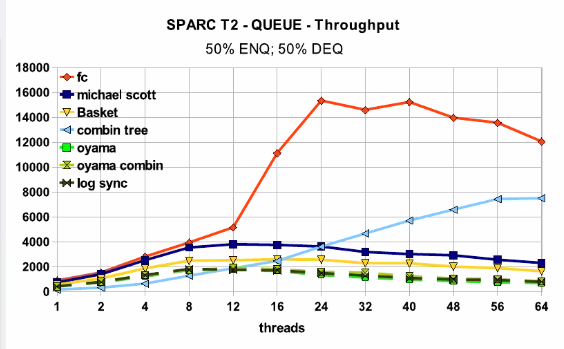

## 0. Введение

### Тенденции развития вычислительных систем, обуславливающие необходимость применения распределённых (параллельных) методов вычислений. Примеры вычислительно ёмких задач из разных областей науки.

Отношения предок-поток значимым образом влияют на поведение процесса

В случае потоков отношений таких не существует. Поток создался и независим, ему все равно на предка

### Классификация параллельных систем (SIMD, MISD…, SMP, MPP)

Sisd single instruction single data

Simd - одна инструкция над неск данными

### Современные высокопроизводительные системы: начиная от расширений SSE, через многоядерность к узлам кластеров

Sse (streaming simd extensions) -- Расширение процессора. Доп регистры с доп иструкциями

Класс оптимизации: векторизация

Больше строковых данных стало

AVX advanced vector extension

Неизвестная инструкция процессора

### Понятия ускорения, эффективности (закон Амдала)


### Старт потока (Java): реализация Runnable vs наследование от Thread

extends лишает нас наследоваться от чего-то другого.

## 1. Многопоточность или IPC

### Виды IPC

IPC — механизмы межпроцессного взаимодействия

- pipe
- shared memory — общий кусок оперативки
- socket — общение по сети
- file
- signal — по природе асинхронный механизм

Преимущества многопоточности:

+ быстрее создание (однако обычно мы просто в самом начале создаем все потоки что нужно и забываем про это)
+ проще осуществлять обмен данными (меньше ошибок в итоге)
+ быстрее обмен данными. Процессу соответствует какая-то страница памяти, которая подгружается. Все потоки одного процесса скорее всего находятся в одно этой странице. Потоки разных процессов гарантированно в разных страницах (надо подгружать)

### Преимущества IPC:

+ надежность. В монолитных ядрах бОльшая надежность, если что-то упадет
+ безопасность. На примере браузера: каждая вкладка это процесс. Если упала вкладка, то легче поднять. У js  с одной вкладки нет доступа к данным в другой вкладке

### Сложности реализации shmem

Проблема: если процесс захватит примитив синхронизации и помер, никто другой не сможет больше захватить. Shmem решает эту проблему

## 2. Завершение потоков

Потоки ОС (posix)

Самый низкоуровневый, который мы можем создать

Типы связанности по силе:

1. Дружественность
2. Наследование
3. Композиция
4. Агрегация

### Корректное завершение потоков:

У потока нет обязательств завершиться. pthread_cancel выставляет потоку флаг, что надо завершиться

В этом другом потоке после каких-то логических действий модно вызывать pthread_testcancel, которая выполнится если нас отменили и осуществит выход из потока

Если хотим выполнить что-то после cancel: _cancel_push, добавит задачу в стек, который будет разматываться после окончания.
_cancel_pop вытащить последнюю задачу из стеку сверху

Если ручками вызывать testcancel, то не все так просто, потому что есть cancellation points, которые внутри себя вызывают testcancel

#### Cancellation points

по сути все что вызывает cancel

Если мы хотим, чтобы в какой-то момент нас не прерывали, то можно сделать disable_cancel, делаем что нам надо, потом enable_cancel

#### Примеры кода в glibc

int cancelhandling флаг в структуре, который позволяет отслеживать. Несколько флагов по битам по сути
Структура cleanup содержит список указателей на функции, которые надо будет выполнить

#### Interrupted exception

Пусть есть два потока, один хочет достать из очереди два элемента
Второй постоянно интерраптит первый
Как нам точно достать? Вынесем логику взятия из очереди в отдельный поток и вызовем его.

### Сравнение различных потоков (POSIX, boost, java)

posix/boost/java:

- создание: create/thread/Thread
- ожидание: join/join/join
- отмена: cancel/-/interrupt

### Проброс исключений между потоками

## 3. Примитивы синхронизации

Примитивы синхронизации бывают разные: честные (падают в кернел спейс) и нечестные (не падают, спин лок)

Зачем примитиву проваливаться в кернел: пришел первый поток, захватил. Второй пришел, пытается захватить.  У него получатся, значит он должен сообщить ядру, что он ожидает, а значит надо сообщить планировщику об этом, значит надо сделать какой-то системный вызов.

Современные примитивы зачастую предпринимают несколько попыток захватить, прежде чем провалиться в кернел спейс.

### Необходимость синхронизации: простые гонки данных

### Реализация примитивов синхронизации: алгоритм булочника

### Виды мьютексов:

#### рекурсивные/нерекурсивные

рекурсивный если в рамках одного и того же потока можем захватывать мьютекс несколько раз

Рекурсивный когда нужен: пусть есть класс вектор, внутри него мьютекс. И два метода: size + push_back. В обоих есть захват мьютекса. Во втором методе если размер какой-то определенный, то чето делаем дополнительно. Т.е. нам опять надо будет захватить мьютекс при сравнении размера.

Как сделать то же самое, но нерекурсивно: все то же самое, но добавить приватные два метода unsafe аналогов. Всю логику переношу туда. В обычных методах блокироваться и вызывать unsafe методы.

Что лучше: надо ориентироваться на:

- тестируемость. Второй вариант лучше с точки зрения тестирования, потому что логика работы с контейнером в одном методе, а многопоточное -- в другом (легче понять где мы упали)
- поддерживаемость. Легкость рефакторинга. Второй вариант лучше, потому что можем легко поменять логику работы контейенера или поменять сам мьютекс.

Иногда говорят, что нерекурсивне примитивы быстрее.

На практике рекурсивные нужно ооочень редко, в большинстве случаев код можно переписать с использованием нерекурсивных. + является то, что при нерекурсивном меньше вероятность ошибки (при освобождении, что не запутаемся).

+ есть мьютекс с таймаутом. Это НЕ решение дедлоков. Нужно использовать только если в логике есть смысл через какое-то время бросать попытку захватить мьютекс.

#### read/write

Можно захватывать только на чтение (тогда несколько читателей могут работать одновременно) и только на запись (когда приходит писатель, все читатели должны завершиться до захвата писателя).

#### spin

крутимся в бесконечном цикле, пока не захватим блокировку (пока cas не сработает).

активное ожидание на захвате. Не использовать если между захватом и освобождением какая-то длительная операция.

#### futex

Fast userspace muTexes. Не предназначены для прямого использования разработчиком, используются под капотом другими мьютексами.

### Корректные захват/освобождение примитивов

рекомендуется использовать RAII

Есть mutex, а есть condition, разные вещи.


Барьер:


Здесь в 13 строчке нужен while, потому что мы должны перепроверять условие.

Почему нельзя после 10 строчки отпустить мьютекс: пусть придет 9 поток, отпустит и заснет (не от wait). Придет 10 поток, увеличит счетчик, увидит, что счетчик достиг максимум и сделает broadcast всех, кто спит. Они проснутся, 9 поток вернется на исполнение и снова заснет. Причем его никто не сможет разбудить уже.

Есть такие системные вызовы, для которых необязательно падать в кернел (время). Ядро само пеиодически в какую-то область памяти кидает какие-то значения, откуда можно их брать. Это оптимизация. Но от этого может страдать безопасность.

### CAS-операции и атомики


Атомики под капотом юзают бесконечные циклы.

### Условные переменные:

использование wait/notify
Spurious wakeups
### Thread Local Storage (TLS)

## 4. Алгоритмы синхронизации

На примере односвязного списка. Работаем чистой многопоточкой на одной машине. Работаем на языке со сборщиком мусора.

Node { data, next, id }

Есть операции:

* add()
* remove()
* contains()

#### Грубая

1. Обычный мьютекс
2. Мьютексы на чтение (contains) и запись

Блокируемся по всему списку.

#### Тонкая

Добавим в каждую ноду свой примитив синхронизации (в джаве объект = уже синхронизация).

```
В любой момент времени, для того чтобы иметь связь с любой структурой данных, имеет смысл обеспечивать захват хотя бы одного примитива синхронизации.
```
Поэтому лучше ходить блокироваться парами по списку.

`Мы не обеспечиваем потокобезопасность хранения данных в узлах, только безопасность узлов`

`Лучше всегда захватывать элементы, у которых хоть как-то меняется состояние`

Что захватывать:


1. При добавлении
   - 3 надо.
   - 7 не надо, потому что даже если кто-то перед нами что-то сделает с 7, то ничего плохого не прозойдет.
2. При удалении
   - 3: если не захватим: один поток пришел удалять 7, заснул перед перекидыванием ссылки, пришел другой поток, подобавлял кучу элементов, проснулся первый, перекинул ссылку, новые элементы потерялись.
   - 7: первый поток удаляет, заснул. Поток второй перед ним подобавлял элементы после 7. Первый поток проснулся и перекинул ссылки, новые элемент пропали.
   - 9 не надо.

`Минус: если мы заблокировали 3, то все новые потоки не смогут пройти дальше, пока 3 не освободится`

#### Оптимистичная

То же самое, что и тонкая, только когда мы нашли две ноды (без синхронизаций), которые надо заблокировать, мы перед взятием можем же заснуть. Чтобы проверить, что все ок, мы должны проверить, что 3 все еще ссылается на 4 после взятия двух блокировок.

Но проблема до взятия блокировок может быть еще в том, что и 3, и 4 удалили. Чтобы это проверить, возьмем две блокировки и дойдем еще раз с начала списка (без синхронизаций) до 3 и 4. Если дошли, значит элементы все еще есть.


Есть смысл делать когда у нас быстро можно осуществить проход по структуре.

#### Ленивая

То же самое, что и оптимистичная, только у каждой ноды есть флаг удаления. И когда поток удаляет, он сначала выставляет флаг и только потом удаляет. И тогда вместо прохода сначала проверяем флаг.  

#### Неблокирующая (параллель с ORM)

1. Удаление: сначала CASом выставляем флаг удаления и если удачно, то CASом перекидываем ссылку. Если не получилось, то идем с самого начала.
2. Добавление: CASом перекидываем ссылки


## 5. Атомарные снимки регистров

Регистр -- это ячейка памяти, в которую можно атомарно что-то записать/считать.


Снепшот должен быть:

1. Согласованным: значит, что когда-то он существовал.
2. Актуальным: какое-то состояние, которое точно было после момента вызова взятия снепшота.


### Классификация алгоритмов:

#### lock-free

Гарантирует, что останавливая в произвольное время произвольное количество потоков, все остальные потоки точно завершат свою работу. Сложнее писать.

В некоторых случаях, например, тонкая блокировка работает быстрее lock-free, когда у нас нет сильной нагрузки и мы успеваем взять-отдать блокировки без падения в kernel.

`Если алгоритм использует только CAS, то это не обязательно lock-free алгоритм. Например спин локи основаны на CAS, но это мьютекс`

`Но если у нас lock-free алгоритм, то это значит, что мы используем CAS или что-то подобное`

#### wait-free

Гарантировать, что и читатель и писатель завершит свою работу за определенное количество шагов (зависящее от структуры) в любое время.


### Lock-free snapshot

Проблема согласованного снепшота в том, что сначала взяли один снепшот, заснули, данные менялись, но в итоге стали такими же, как и до засыпания, взяли второй снепшот и он типа равен первому. Хотя по факту между двумя снепшота были действия, о которых мы не знаем.

Решение: добавить версионирование, при каждом изменении регистра инкрементируем его версию.

### Wait-free snapshot

#### SWMR

При изменении регистра обязательно берём снепшот

Взяли 1 снепшот. Взяли 2. Если они равны, то возвращаем 2.
Если не равны, значит кто-то что-то записал (в 1 регистр например). Снепшот между 1 и 2 возвращать нельзя, потому что он мог быть взят до 1го (совсем протухший).

Взяли 3 снепшот. Если 2 и 3 равны, то вернем 3.
Если не равны, значит кто-то что-то сделал между 2 и 3 (например во 2 регистр). Его вернуть нельзя ибо этот снеп мог быть сделан до 1го

Берем 4 снепшот. Если 3 и 4 равны, то возвращаем 4.
Нет - если изменили 1 регистр, значит этот снепшот мог быть сделан не раньше чем 1.5 снеп. Значит можно его взять.

Поскольку внесли изменения более 1 раза, значит снепшот более актуальный. 

Используют в планировщиках ОС жесткого реального времени (атомные станции). Гарант времени отклика системы жесткий.

`Любой lock-free алгоритм можно преобразовать в wait-free. Но это надо очень много памяти зачастую (кубических размеров)`

В wait-free писатели очень часто обязаны делать что-то еще, помимо своих записей, чтобы обеспечить гарант


#### MWMR

Не получится в один регистр все записать. В отдельном регистре храним данные и id потока, который последний изменил. В другом регистре храним данные потока: снепшот и его view

Не атомарны записи в оба регистра, о чем следует помнить.

Мы должны наблюдать не 2, а 3 изменения регистров: если 3 раза встретили изменение, тогда снепшот актуален и согласован (а не 2 раза, как при swmr)


## 5. Ошибки || программирования

### Основные ошибки многопоточного программирования

#### Гонки данных (Data Race)

Нечто, что приводит к ошибкам из-за несогласованного, конкурентного доступа к оперативной памяти.

- Пусть копируем 64ное число двумя инструкциями по 32, значит в какой-то момент одну часть скопировали, а другую нет: получаем значение, которого никогда не существоало
- Пусть в бд есть какие-то объекты, которые мы загружаем. Пусть есть объекты a, b, с какими-то полями. Пусть объекту x присвоили а, а потом b и в этот момент кто-то читает x, которому скопировали только часть полей.
- пусть есть байт, который инкрементим (долго) в двух потоках. Может быть такое, что одновременно считали 0, одновременно инкрементировали и в итоге получили 1 (что нлеогично).

*Линеаризуемость* = корректность: если какое-то параллельное исполнение и мы можем подобрать какое-то последовательное исполнение из тех же операций, чтобы получить тот же результат, значит программа корректна. Если есть хотя одно, что результат не совпадает, то все плохо.

Пример когда нельзя ленеаризовать: 1 поток читает, 2 поток прибавляет, 3 поток инкрементирует. считали 0, добавили 10, инкрементировали 1. Никак не линеаризовать.


Защита от гонки (valgrind):

1. Можно запоминать к какому конкретно блоку памяти был доступ из какого потока на чтение/запись и сообщать пользователю если он задетектил доступ из разных потоков без захвата хотя бы какого-то примитива синхронизации.
2. Когда будет найдена гонка, но нее нет. Есть класс, с полем и конструктором (в котором инициализировали поле). В методе print создаем новый поток, в котором выводим это значение.

В мейне создаем объект этого класса и вызываем print. Гонки не будет, но для valgrindа в конструкторе произошел доступ к полю из одного потока, а принт из другого

Другой пример: создали все потоки. Только один поток готовит какие-то данные. В конце он сделает notifyAll и все другие потоки будут читать эти данные (только после нотифая, гонки нет).

Гонки данных тяжко детектятся :(

#### Взаимная блокировка (Deadlock)

Несколько способов получить:

1. Использование нерекурсивных примитивов:

- когда дважды один и тот же примитив пытаемся захватить
- Реакция потока на сигнал.

пусть мы написали обработчик сигнала. Когда придет сигнал, он может быть обработать в потоке: main/новом/который подписан на сигнал/случайном. Правильно: в случайном потоке. Почему не обязательно в том, который подписан: потому что мы это можем сделать в таком потоке, который может не существовать когда сигнал придет. Хотя по идеи можно сказать потоку, чтоб он не обрабатывал сигнал. Так сделать с каждым потоком и сигнал обработается тем потоком, которому последнему не успели сказать "нельзя". Но это тоже бессмысленно.

Тогда может быть ситуация: пусть в хендлере сигнала мы что-то делаем с вектором. Но перед этим, поток, который был случайно выбран для обработки сигнала, спрашивал размер вектора и был заблокирован нерекурсивным примитивом. После блокировки он перекинулся на хендлер. Получаем дедлок на попытке захватить притив синхронизации из случайного потока, когда мы сами стали этим случайным потоком.

Решение: не писать сложную логику в обработке сигналов. Никаких syscallов и прочего, а просто, например, выставлять какой-то флаг, который будет везде проверяться.

2. Перекрестный дедлок

в одном потоке в одном порядке захватываем притив, в другом -- в другом.

Как исправить: обеспечить глобальный одинаковый порядок захвата примитивов (по приоритету, например).

Как найти: через дебаг. С помощью valgrind можно найти ошибки потоков (неправильный порядок локов в том числе). Он находит все локи и пытается смоделировать дедлоки (могут быть ложные срабатывания). НО: он не найдет точно дедлоки на спинлоках, потому что мы просто крутимся в цикле, без syscallов, не найдет когда в хендлере сигнала захватываем.

3. Блокировки при fork многопоточных программ.

Пусть есть процесс, в нем два потока и есть примитив синхронизации. Пусть второй его захватил. Пусть первый делает форк (создаем копию процесса на момент форка). Они не связаны ничем кроме отношения предок-потомок. В копии есть копия примитива, захваченный. После форка у нас будет один поток в копии. Почему: это единственный поток, откуда мы знаем как запустить детерменированно и одинаково, потому что если все потоки копировать, то мы копировать будем в случайном порядке, с контекстами, взятыми в случайное время и т.д.

Скопированный поток попытается захватить примитив. Он уже захвачен (и не освободится, потому что это просто копия захваченного притива). Получаем дедлок.

Если поток с захваченным примитивом умер, то значит, что он оставил какие-то данные, ассоциированные с этим примитивом. И лучше пусть эти данные не достанутся никому, чтобы обеспечить детерменированность.

Решение проблемы: pthread_atfork(f*,g*,h*). Принимает три указателя на три функции (регистрация трех каллбеков, выполняются перед форком) Гарантирует выполнение f* в рамках первого процесса до форка, g* в рамках первого процесса после форка и h* в рамках второго процесса после форка. Тогда в f захватываем все примитивы что нам нужны (чтобы другие потоки не смогли успеть захватить), а в g и h освободить их.

#### Инверсия приоритетов

Пусть есть система, в которой есть приоритет процессов (пусть одноядерная система). Есть 3 потока с 3 разными приоритетатми A, B, C, разделяющие один пимитив синхронизации, который разделяют А и В.

* В первый момент времени мьютекс не заблокирован.

Поток В находится в состоянии исполняюсь (готов/исполняется).

Поток С находится в состоянии заблокирован (еще не готов исполняться) (заблок/готов/испол).

Поток А находится в состоянии заблокирован (заблок/исполн).

* В делает лок примитива, остальные потоки заблокированы.
* поток А готов к исполнению и т.к. у него приоритет выше, он начинает исполняться.

поток С тоже готов, но т.к. система одноядерная, а уже исполняется поток А, он в состоянии готов к исполнению

поток В становится готовым к исполнению из-за приоритета. Примитив по прежнему заблокирован.

* поток А пытается захватить примитив, не может, переходит в состояние заблокирован

поток С по приоритету начинает работать

В не исполняется. Примитив захвачен

Такая ситуация может быть бесконечно, потому что А и В заблокированы, в итоге постоянно исполняется С, у которого произошла фактически инверсия приоритета. В итоге С исполняется больше, чем А, хотя не должно быть так.


Что делать: поднять приоритет потоку В, чтобы он отпустил блокировку.

#### Проблема ABA

Специфично только для lock-free алгоритмов. Пусть пишем на нативном языке (без сборщика мусора и с прямым доступом к памяти). Есть стек. На вершине его лежит А.

Есть операция push, которая складывает на вершину стека толькое если там лежит что-то.

Как работает эта операция: считали вершину. Сделали проверку что там лежит и если что добавляем.

Пусть считали топ, сделали проверку и заснули.

Пришел второй поток, сделал поп и пуш В. Поскольку мы используем какие-то аллокаторы, то они в основном оптимизирующие, значит с великой долей вероятности мы после пуша вершина будет указывать на ту же область памяти, что и А, только данные там будут лежать В.

Просыпается первый поток и делает CAS, чтоб проверить, что топ не поменялся. А т.к. адреса одинаковые у топа нового и его старого, то КАС пройдет, хотя там другие данные.

Умные указатели не помогут, потому что не совсем понятно, что менять первее: счетчик указателей или элемент.

##### Решение SMR

- tagged ptr. Адрес 64, указатель 48, значит 16 бит можно каждый раз инкрементировать, когда, когда кто-то обращается к объекту. Т.е. фактически у нас каждый раз будут разные адреса (грубо говоря, из-за инкрементации) и КАС не пройдет.
- написать свой сборщик мусора, который бы решал эту проблему.
- hazard pointers. Для каждого потока достаточно будет таких указателей = количеству примитивов, которые надо захватывать при тонкой блокировке (инвариант структуры). 

## 7. Модель памяти

### Пример ошибки в ядре ОС

### Устройство кэшей процессора

Два кэша и один брокер. Первый кэш хочет получить 1 из памяти, подгружается через брокер 1 в линейку кэша. Инкрементирует ее. Второй кэш тоже хочет получить 1. Но бркоер понимает, что эта область памяти уже есть в другом кэше, поэтому он скопирует ту линейку кэша из первого кэша во второй.

### Пример на протоколе MESI

Предполагает добавление к линецке кэша состояние.

Состояние, когда в линейке кэша нет ничего -- invalidated

Пришла единица -- excluzive. Т.е. данные находятся только в одном кэше. И значение еще и не модифицировано (не надо синхронизировать с памятью).

Изменили что-то -- modified. Значит, что когда будет синхронизировать с памятью, то надо будет записать новое значение.

Когда еще с каким-то кэшом поделились линейкой -- shared. Т.е. данные находятся в больше чем одном кэше процессора.

Когда во втором кэше мы поменяли значение, то шлем всем ядрам специальный запрос: read invalidate. Т.е. другие кэши должны будут инвалидировать свое значение и сделать запрос read, считав тем самым наиболее актуальное значение у какого-то кэша (у нашего скорее всего, второго). Когда все другие ядра обработали этот запрос, они шлют запрос invalidate actual (???). А ядро, которое послало запрос чтоб все обновились -- ждет подтверждения от других ядер.

Из минусов: ядро-иниициатор ждет, а другие ядра должны все бросить и начать отвечать.

Для решения этого ввели две новые абстракции (аппаратные элементы): invalidate queue, store buffer. Тогда, когда второе ядро отправляет запрос, то оно просто скидывает в store buffer свою линейку и продолжит работать, периодически проверяя вернулись ли все запросы. Запрос этот другим ядрам приходит в invalidate queue. Эта очередь работает не совсем честно: запросы оттуда будут выполнены только тогда, когда ядру будет удобно, а не сразу.

Причем ack будет отослан не тогда, когда запрос выполнится, а когда только положится (чтоб ядро-инициатор не сидел грустил).

Есть модификации MOESI

### Барьеры памяти (store/load)

Зачем нужны вообще

```
f() {
   a=1;
   b=1;
}
```

Кэш 1го ядра содержит

a(S)

b(E)

```
g() {
   while(b==0) continue
   assert(a==1)
}
```

Кэш 2го ядра:

a(S)


Порядок операций:

1. выполнили a=1 => линейка кэша уходит в store buffer и отправляется запрос read invalidate

2. b=1 => b(M)

3. while() выполнился => отправили read

4. в 1 ядро пришло read => b(S)

5. пришло во 2 ядро b => вышли из цикла

6. assert() падает

7. 2 ядро начинает отрабатывать invqueue => отослали назад ack

8. 1 ядро очистило store buffer

В итоге вроде как все отослали, но второе ядро в итоге видит изменения в обратном порядке, сначала b и только потом a


Проблема на уровне исполнения.

Все барьеры применяются только на одном ядре! Налаживаем частичный порядок работы (с кешами) в каждом из потоков и таким образом в целом что-то хорошее выходит.

Барьер памяти — просто ассемблерная инструкция ,которая применяется к одному из процессов smp_rmb — read memory barrier, smp_rwb, smp_rmb — read & write. И предлагает ему честно ждать одну из очередей.

`X_Y`

Все операции типа х до барьера выполнятся гарантированно до всех операций типа у после барьера.

В итоге возможно 4 разных типа барьера памяти:

- LoadLoad
- LoadStore
- StoreLoad
- StoreStore

В примере выше на 1 ядре нам надо обеспечить гарантию записи, значит надо использовать StoreStore. Это значит, что мы не будем выполнять b=1 пока не дождемся всех ack про а.

На 2 ядре мы только читаем, значит надо использовать LoadLoad


### Acquire/release семантика

Барьеры объединили в группы

1. Acquire группа = LoadLoad, LoadStore, потому что что-то читаем

2. Release = LoadStore, StoreStore, потому что что-то отпускаем в конце.

3. StoreLoad = ни в какой группе, по сути


Почему семантика так называется: потому что по сути мы между acsquire и release захватываем ресурсы, и код оттуда никуда не может перейти. Мы как бы захватываем и потом отпускаем.


### Модели памяти: Sequential consistency…

Модель памяти — набор барьеров, которые автоматически гарантирует конкретная архитектура или и иной уровень абстракции (наиболее высокий уровень абстракции).

Модель памяти может гарантироваться:

- архитектурой процессора
- фреймворком
- языком программирования высокого уровня (должна гарантировать на всех машинах независимо от модели памяти архитектуры, на котором будет исполняться код)

#### Sequential consistency

Любая операция чтения/записи приводит к применению всех 4 барьеров.

Процессор предоставляет какую-то модель памяти. ЯП тоже предоставляет какую-то можель памяти. ЯП гарантирует эту модель вне зависимости от процессора.

Можно представить, что тогда у ядер нет store buffer / invqueue, он всегда работает честно

#### Strong ordering (TSO)

Применяются 3 барьера, которые входят в семантику acquire/release. Любая операция чтения/записи обеспечивает acquire/release. В архитектуре применены по умолчанию.

Пример: ожидаем чтобы хоть какой-то ассерт упал


TSO этот случай не покроет.

amd64/x86_64

#### Weak ordering

Заставляет явно задумывать о всех 4 барьерах.
ARMv7

#### Super weak

В отличие от weak, здесь есть возможность перестановки инструкций зависимых по данным в одном потоке

Например:

```
int* x;
x = now int(20);
*x=5;
```

2 и 3 строчки могут переставляться

Alpha

### Примеры

1. JRE 

При работе с volatile компилятор в байткод анализирует код и ставит один из барьеров. Затем для каждой архитектуры оно реализуется по-своему.

Реализует слабую модель памяти.

2. Нативные ЯП

По умолчанию sequential consistency. Можно указывать какую модель памяти использовать(пеедать как параметр в какой-то там атомик).

Можно без атомиков явно взять и поставить барьер памяти посередине кода.

3. Как достичь максимальной производительности:

Пример:

isReady — атомик флаг

Первый поток:

```
void f(){
    data = 42;
    //StoreStore -- release
    ready.store(true, ?);
}
```

Второй поток:

```
void g(){
    if(ready.load(?)){
        //LoadLoad -- acquire
        assert(data == 42);
    }
}
```

Так можно достичь максимальной производительности.

4. Неявное использование барьеров:

- при захвате/освобождении примитивов: внутри него есть флаг, который разделяется, для которого нужен барьер
- При разных syscallах. При смене контекста, когда планировщик снимает поток с исполнения, применяются все барьеры, потому что следующему потоку неинтересно получить инвалидацию от предыдущего потока, поэтому надо все подчистить.
- atomic (lock-free алгоритмы и т.д.) применяют их явно.
- volatile в java — способ явного указания для использования барьеров памяти. В с++ volatile никакого отношения к барьерам памяти не имеют.


## 8. Профилирование многопоточных приложений

### Средства анализа производительности

Утилита time
Intel Parallel Studio
Valgrind (модули callgrind, cachegrind)
### Пример поиска узких мест

### Профилирование промашек по кэшу и метрика CPI

## 9. Flat-Combining

Пусть есть какая-то сложная структура с добавление/удалением и прочим операциями.

### Схема Flat-Combining

Добавим объект FC, который агрегирует структуру данных. Извне предоставляет интерфейс доступа нехарактерный для самой структуры, типа doOperation, который будет добавлять в этот объект необходимую операцию.

Сначала регистрируем поток в объекте, внутри которого есть список публикаций других операций, которые хотят другие потоки сделать со структурой.  Одна нода такого списка соответствует списку операций для одного потока. Причем хранится этот список с TLS (thread local storage)

При doOperation мы публикуем операцию в TLS, так что внутри объекта операция будет сразу же видна.

Далее пытаемся захватить примитив, который один на весь объект (без разницы какого именно типа). Если получается, то становимся потоком-combiner и выполняем все операции из списка за все потоки. Иначе -- ждем, пока или получим лок или кто-то за нас выполнит операцию.

Используется в основном если надо в разы повысить производительность, как один из инструментов.

### Возможные оптимизации за счёт интерференции операций


### Сравнение производительности с lock-free очередью Michael & Scott

При 24 потока производительность намного лучше, чем lock-free очередь.




Количество проваленных касов на операцию:


Намного меньше, потому что касов в FC меньше.

Главное преимущество:


1. Количество промашек по кэшу: когда идет работа над структурой в рамках одного потока лучше, потому что не надо подгружать ничего.

2. Можно сокращать пуш и поп, например (аннигиляция операций).

3. Интерфецируется комбайнер. Если выполняем мало операций, т.е. используем мало предоставленный квант времени и ресурсы, то нас может планировщик урезать. Иначе -- наоборот могут дать больше ресурсов.

## 10. RCU

### Суть RCU и синхронизация на эпохах

### Kernel-space RCU

### User-space RCU

## 11. Транзакционная память

locking, проблемы:

1. Сложность осуществления атомарных операций (хэш таблицы).
2. нет связи ресурс-примитив
3. сложность реализации cas
4. сложность контроля жизни
5. инверсия приоритетов

транзакцию начинаем

Пусть есть приложение и ORM  и БД. Хотим внестри изменение, ORM делает запрос select в бд, возвращает в приложение. Меняем данные, отдаем ORM, которое сначала опять сделает select, чтобы проверить что между первым селектом ничего не изменилось

Транзакция начинается в момент второго селекта.

Выглядит как высокоуровневый кас


### Идея transactional memory

Идея та же, только на уровне памяти: кто-то должен выступать в качестве ORM между приложением и RAM

#### Software transactional memory

транзакционная память есть в хаскелле (впервые). Реализована прямо по статье

из плюсов:

1. нет локов
2. описываем ЧТО защищаем, а не КАК
3. есть контроль: откат, повтор
4. улучшенная утилизация ресурсов.


#### Hardware transactional memory

Ограничение, что транзакция завершится в рамках одного кванта времени (выделенного времени на исполнение процесса ОС) и ограничение на размер кэша.

Transactional synchronization extention (TSX)

### Преимущества и круг задач

в основном в академических исследованиях.

В джаве в последних версиях включена (по умолчанию).

В промышленности использование сомнительно.

### Реализация HTM на линейках кэша

Линейке кэша выставляется бит, когда начинается транзакция, когда любое другое ядро работает тоже с этой линейкой кэша и вносит изменения, то остальные ядра понимают, 
что с этой линейкой кэша, которая находится в транзакции, что-то сделали, значит транзакцию надо отменить.

### Lock teleportation

Пример подхода использования транзакционной памяти в гибриде с еще чем-то.

Можно навесить память при fine-grained блокировке (список). Захватили элемент, начинаем транзакцию, перемещаемся на некоторое кол-во элементов вперед без синхронизации, захватываем элемент куда пришли. Если транзакция завершилась, значит никаких изменений не было внесено, память на этом участке не трогали, можно двигаться дальше. Иначе -- транзакция отменилась, кто-то другой внес изменения (даже если просто захватил примитив), начинаем с последнего удачно захваченного элемента. Ломает запись, а не чтение. 


При неудаче в классическом подходе уменьшаем размер в ддва раза, на который мы прыгаем вперед. А если удача, то увеличиваем на 1.

По аналогии с TCP, который подстраивается под пропускную способность.

## 12. Асинхронный ввод/вывод

### Блокирующий/неблокирующий

Есть две независимые классификации: 

- блокирующий. `read(buf, 1024)` -- выйдем из этой функции когда появятс данные, иначе -- заблокируемся в ожидании.
- неблокирующий -- устанавливаем дескриптору ресурса флаг non-block. Тогда когда мы вызываем read мы вернем 0 если нет данных и выйдем из функции.

### Синхронный (реактор)/асинхронный (проактор)

Сигналы по природе асинхронны, потому что мы не знаем когда нам придет ответ или когда на сигнал отреагируют. В этом по сути и суть асинхронщины: мы не знаем когда у нас придут данные.

#### Шаблон Proactor

Описывает, каким образом нам придет коллбек.

Когда кто-то начинает асинхронную операцию, он называется `Initiator`. Он выполняет создание асинхронной операции (`.async_read()`). Инициатором никогда не будет потом-демультиплексор. Это какой-то другой поток.

Чтобы обработать данные, которые инициатору когда-то там придут назад надо создать обработчик коллбека: `completion handler`.

Асинхронная операция передается в `async operations processor`: ядро асинхронного ввода-вывода, из него получаем очередь событий `event queue`, которые произошли на тех дескрипторах ресурсов, которые были в асинхронных операциях, которые мы заказали. Очередь содержит в себе тип операции `async op` и `completion handler` соответствующий. Т.е. когда нам пришли данные каким-то магическим образом, то этот процессор данные вместе с соответсвующей операцией кладет в очередь событий.

Затем сущность `event demultiplexor` разгребает эту очередь. Может состоять из нескольких потоков

Непосредственно `Proactor`, после того как `event demultiplexor` вытащил из очереди, вызывает функцию `completion handler`а, которая пришла через очередь событий и была демультиплексирована `event demultiplexor`ом. Обычно это наш код, поэтому он вне фреймворка. Вырожденная сущность, которой может и не быть.

Часто внутри колбека вызывается другая асинхронная функция и `Proactor` становится инициатором. Потому что обычно мы подписываемся только на чтение одной порции данных. Поэтому колбек подписывается повторно.


*Почему в асинхронных фреймворках обычно подписываемся только на одну асинхронную операцию, а не на несколько сразу?*

UDP сокет datagram. Мы точно отправили за 1 send 1400 байт. Есть ли гарантия, что мы строго за одну операцию чтения получим либо все данные, либо ничего? Да, гарантируется протоколом.

А для TCP stream? Нет. Обычно в TCP приходится помимо данных еще и отправлять размер данных.

Поэтому в демультиплексере пришлось бы учитывать еще и порядок обработки! Так как пришли и обрабатывались одновременно несколько частичек одного и того же сообщения. И надо было бы вручную определять в каком порядке что обрабатывать, что не предусмотрено фреймворком по умолчанию.
Поэтому на сообщения одного и того же сокета, одного типа обрабатывать не получилось бы.

СОКЕТЫ — это просто обертки над портами. Смотрим tcp сервер

На серверном сокете делает асепт. Когда подключается клиент — создается конкретный сокет с этим клиентом.

### Преимущества асинхронной работы и реализация со стороны операционной системы

### Библиотеки асинхронного ввода/вывода

## 13. Линеаризуемость

### Понятие линеаризуемости

Когда результат исполнения параллельного кода соответствует какому-то хотя бы одному последовательному исполнению.

### Lock-free стек Trieber

### Пример на очередях

### Lock-free очередь Michael & Scott

Имеем два указателя на голову и хвост. Голова указывает на нулл указывает. 

При добавлении касом тейл указывает на новую ноду. И при перемещении на новый тейл тоже касом каждый поток, который делает вставку тоже проверяет, надо ли пофиксить хвост и при необходимости фиксит. Благодаря этому мы исключаем ситуацию, когда перекладываем ответственность за передвижение хвоста только на поток, который добавляет. Соответственно исключаем ситуацию, когда добавляющий поток заснул надолго и оставил неправильный тейл.

При добавлении просто делаем один кас, перекидываемый голову на элемент вперед.

При такой стратегии добавления нод гарантируется, что хвост не будет отставать от реального хвоста не более чем на 1 ноду. Причем если нам удалось добавить к хвосту новую ноду, то нам без разницы результат перекидывания хвоста на новую ноду, потому что вдруг кто-то другой уже добавил что-то еще и перекинул за нас хвост.

Получаем бОльшую производительность.

### Точки линеаризации

Зачастую кас, на основе которых принимаем решение о линеаризуемости.

### Relaxed SkipList

## 14. OpenMP

### Архитектура работы через директивы препроцессора

#pragma omp parallel
Сгенерирует код, который определит кол-во ядер и запустит код в {} в том количестве потоков, сколько ядер. Код в {} выделит в отдельную функцию, которую запустит и в конце все заджоинит

for -- распараллелит форик (несложный)

### Параллельные секции

section - каждая секция в отдельном потоке. Но есть проблема если одноядерная архитектура, а секций две. (producer-consumer)

### Области видимости переменных

Область видимости по дефолту shared

Private

reduction(op:s) - распараллелит и после выполнения выполнит op надо локальной s из главного потока

### Ограничения

master {} код внутри выполнится только в одном потоке, для других потоков этот код не сгенерится

### Миграция вычислений

offload главное направление, отправить вычисления на внешнее устройство.

В промышленном программировании лучше не надо.

## 15. Intel TBB

### Алгоритмы

Parallel do

Pipeline

### Аллокаторы

Cache aligned allocator - одна структура равна одной линейке кэша (32/64). Решение проблемы false sharing

Scalable allocator - для каждого потока выделяется большой участок памяти

### Деревья задач

### Особенности планирования (work stealing…)

### flow graphs (параллель с BPEL)

Flow graph - позволяет строить дерево передачи данных между задачами. Позволяет разгрузить обработку данных

## 16. Акторная модель

### Суть модели:

Передача сообщений
Легковесные процессы
BEAM
### Применение в современных языках:

Erlang
Elixir
